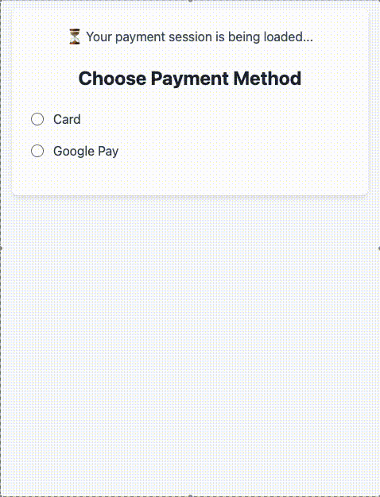

# 💳 Pay with Flow — Checkout.com Demo

This is a simple full-stack demo of a payment form powered by **Checkout.com Flow Web Components**. It allows users to select a payment method (e.g. Card or Google Pay) and renders the corresponding Flow component dynamically.

## 🧰 Stack

- **Frontend**: HTML + TailwindCSS + Vanilla JS
- **Backend**: Node.js + Express
- **Payments API**: [Checkout.com Payment Sessions](https://www.checkout.com/docs/payments/accept-payments/accept-a-payment-on-your-website/get-started-with-flow#Step_1:_Create_a_new_Payment_Session_)
- **CSS**: TailwindCSS via CDN

---

## 📸 Preview



---

## 📦 Setup Instructions

### 1. Clone the project

```bash
git clone https://github.com/dmytro-anikin-cko/flow-split-paymentMethods.git
cd checkout-flow-demo
```

### 2. Install dependencies
```bash
npm install
```

### 3. Create a .env file
Add your Checkout.com secret key in a .env file:
```sh
CKO_SECRET_KEY=sk_sbox_XXXXXXXXXXXXXXXXXXXXXXXX
```
> 💡 Make sure you're using your sandbox secret key from Checkout Dashboard.

### 4. Run the server
```bash
npm start
```
Then open your browser and navigate to:
http://localhost:3000

---

## 📁 Project Structure
```bash
checkout-flow-demo/
│
├── public/
│   ├── index.html      # Frontend UI
│   └── script.js       # Frontend logic for Flow setup
│
├── .env                # Environment variables
├── server.js           # Express backend
├── package.json        # Node.js dependencies
└── README.md           # This file
```
---

## 🧪 Testing Notes
Card payments accept [test card](https://www.checkout.com/docs/developer-resources/testing/test-cards) numbers like `4242 4242 4242 4242`

---

## 🛡️ Disclaimer
This is a sandbox demo and not production-ready. Do not expose your secret keys in the frontend. Always follow Checkout.com best practices when integrating payments.
